# Automation Exercise E2E Test Framework

A comprehensive E2E testing framework for [automationexercise.com](https://automationexercise.com) built with CodeceptJS and Playwright.

> 📖 **New here?** Check out the [QUICKSTART.md](QUICKSTART.md) for a 5-minute setup guide.

### 📚 Documentation

| Document | Description |
|----------|-------------|
| [QUICKSTART.md](QUICKSTART.md) | 5-minute setup guide |
| [docs/TEST_STRATEGY.md](docs/TEST_STRATEGY.md) | **Test strategy & architecture decisions** |
| [docs/ARCHITECTURE.md](docs/ARCHITECTURE.md) | **Framework architecture diagrams** |
| [docs/EMAIL_TESTING.md](docs/EMAIL_TESTING.md) | **Email testing with Mailgun** |
| [docs/AI_TESTING.md](docs/AI_TESTING.md) | Playwright MCP & AI integration |
| [docs/ACCESSIBILITY.md](docs/ACCESSIBILITY.md) | WCAG, EAA, ADA compliance testing |
| [docs/prompts/](docs/prompts/) | **AI prompts for any assistant** (Copilot, Cursor, ChatGPT, etc.) |

---

## 🎯 Features at a Glance

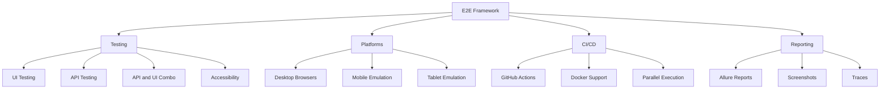

---

## 🏗️ Architecture Overview

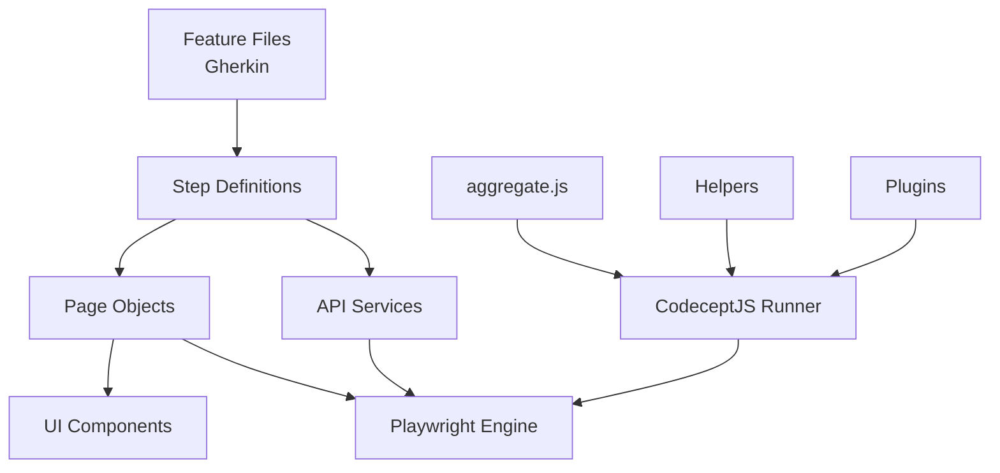

---

## 📁 Project Structure

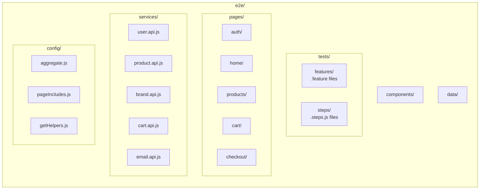

<details>
<summary>📋 Full Directory Structure</summary>

```
e2e/
├── config/                 # Configuration files
│   ├── aggregate.js        # Dynamic config aggregation
│   ├── pageIncludes.js     # Page object registry
│   ├── getHelpers.js       # Helper configuration
│   ├── getPlugins.js       # Plugin configuration
│   ├── bootstrap.js        # Pre-test setup (cleans reports)
│   └── teardown.js         # Post-test cleanup (generates reports)
├── components/             # Reusable UI components
│   ├── navbar.component.js
│   ├── footer.component.js
│   ├── modal.component.js
│   └── sidebar.component.js
├── data/                   # Test data
│   ├── testData.js         # Entry point - selects config by ENVIRONMENT
│   ├── testData.local.js   # Local environment test data
│   ├── testData.staging.js # Staging environment test data
│   ├── testData.prod.js    # Production environment test data
│   ├── testState.js        # Shared state between steps
│   └── userGenerator.js    # Dynamic user generation
├── helpers/                # Custom helpers
│   ├── playwrightHelper.js     # Ad blocking, force click, DOM cleanup
│   ├── accessibilityHelper.js  # WCAG/EAA/ADA compliance testing
│   ├── actorCapabilities.js    # Click helpers, ad dismissal
│   └── perplexityHelper.js     # AI-powered test analysis
├── pages/                  # Page objects
│   ├── auth/
│   ├── home/
│   ├── products/
│   ├── cart/
│   ├── checkout/
│   ├── account/
│   └── contact/
├── services/               # API services
│   ├── user.api.js
│   ├── product.api.js
│   ├── brand.api.js
│   ├── search.api.js
│   ├── cart.api.js
│   └── email.api.js        # Mailgun email service
├── scripts/                # Runner scripts
│   ├── run-e2e.js          # Single execution runner
│   └── run-e2e-parallel.js # Parallel execution runner
├── tests/
│   ├── features/           # Gherkin feature files
│   │   ├── accessibility/  # WCAG 2.2 AA, EAA, ADA tests
│   │   ├── api/
│   │   ├── auth/
│   │   ├── cart/
│   │   ├── checkout/
│   │   ├── mobile/
│   │   └── products/
│   └── steps/              # Step definitions
│       ├── accessibility.steps.js  # Accessibility test steps
│       ├── common.steps.js
│       ├── auth.steps.js
│       ├── product.steps.js
│       ├── cart.steps.js   # Includes checkout steps
│       └── api.steps.js
├── codecept.conf.js        # CodeceptJS configuration
├── package.json
├── Dockerfile
└── docker-compose.yml
```

</details>

---

## 🚀 Quick Start

```bash
cd e2e && pnpm install && pnpm exec playwright install --with-deps
```

---

## 🎮 Running Tests

### Command Format

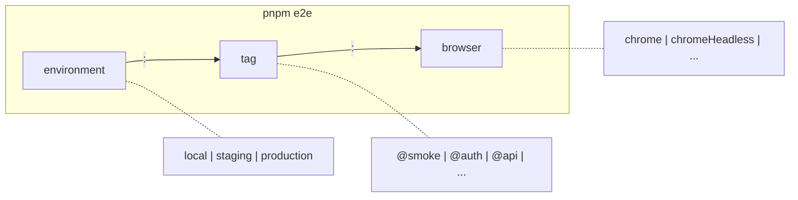

### Examples

```bash
# Smoke tests (headless)
pnpm e2e local:@smoke:chromeHeadless

# Auth tests (visible browser)
pnpm e2e local:@auth:chrome

# Parallel execution (4 workers)
pnpm e2e:parallel local:@smoke:chromeHeadless 4
```

### Browser Profiles

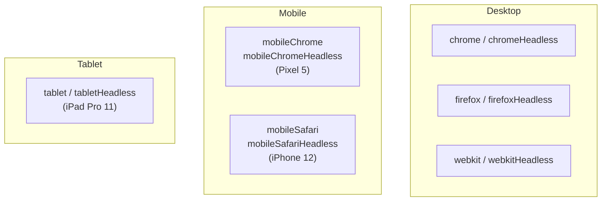

### Quick Reference

| Command | Description |
|---------|-------------|
| `pnpm e2e local:@smoke:chromeHeadless` | Smoke tests, headless |
| `pnpm e2e local:@auth:chrome` | Auth tests, visible browser |
| `pnpm e2e local:@api:apiOnly` | **API-only tests (no browser)** |
| `pnpm e2e local:@mobile:mobileChromeHeadless` | Mobile tests on Pixel 5 |
| `pnpm e2e:parallel local:@smoke:chromeHeadless 8` | Parallel with 8 workers |
| `pnpm e2e:dry-run` | Validate steps without running |
| `pnpm clean` | Clean output directories |

---

## ⚙️ Environment Configuration

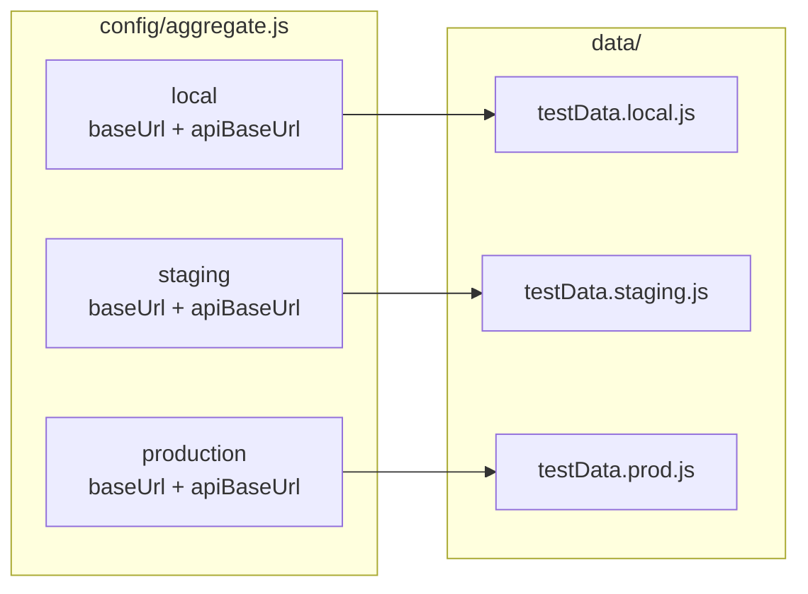

---

## 🏷️ Test Suites

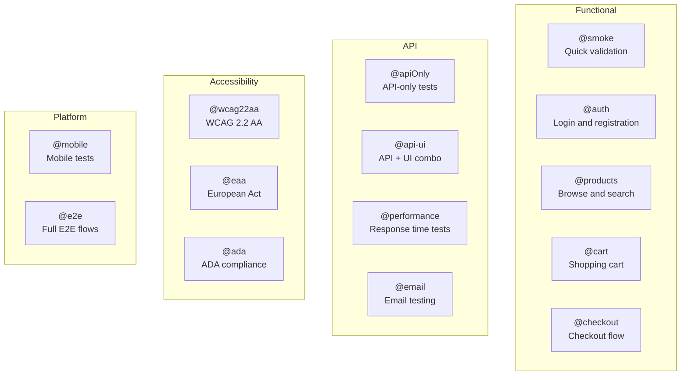

---

## ♿ Accessibility Testing

> 📖 **Full Documentation**: [docs/ACCESSIBILITY.md](docs/ACCESSIBILITY.md)

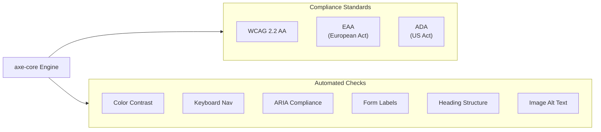

### Quick Commands

```bash
pnpm e2e:a11y    # All accessibility tests
pnpm e2e:wcag    # WCAG 2.2 AA only
pnpm e2e:eaa     # European Accessibility Act
pnpm e2e:ada     # Americans with Disabilities Act
```

### Accessibility Report

When running `@accessibility` tests, a detailed **Markdown report** is automatically generated:

```
e2e/ACCESSIBILITY_REPORT.md
```

**Features:**

- 🔴 Critical, 🟠 Serious, 🟡 Moderate, 🟢 Minor violation indicators
- WCAG references with remediation links
- Affected elements with CSS selectors
- Summary tables per page/scan

After test run:

```
♿ ACCESSIBILITY REPORT:
   📄 /path/to/e2e/ACCESSIBILITY_REPORT.md
   Open with: open ACCESSIBILITY_REPORT.md
```

<details>
<summary>📖 AccessibilityHelper Methods</summary>

```javascript
// Full compliance scans
await I.helpers.AccessibilityHelper.runWCAG22AAScan();
await I.helpers.AccessibilityHelper.runEAAScan();
await I.helpers.AccessibilityHelper.runADAScan();

// Specific checks
await I.helpers.AccessibilityHelper.checkColorContrast();
await I.helpers.AccessibilityHelper.checkKeyboardAccessibility();
await I.helpers.AccessibilityHelper.checkFormAccessibility();

// Assertions
helper.assertNoViolations(results);
helper.assertNoCriticalViolations(results);
```

</details>

---

## 📧 Email Testing with Mailgun

*This is not related to the project. Added just to showcase the email testing functionality*

> 📖 **Full Documentation**: [docs/EMAIL_TESTING.md](docs/EMAIL_TESTING.md)

Test email functionality using Mailgun (with mock mode for demos):

```bash
# Run email tests (mock mode - no credentials needed)
pnpm e2e local:@email:apiOnly

# Run with real Mailgun credentials
MAILGUN_MOCK_MODE=false pnpm e2e local:@email:apiOnly
```

### Configuration

Add to your `.env` file:

```bash
MAILGUN_API_KEY=key-xxxxxxxxxxxxxxxxxxxxxxxxxxxxxxxx
MAILGUN_DOMAIN=sandbox1234567890abcdef.mailgun.org
MAILGUN_MOCK_MODE=false  # Set to 'true' for demo/CI
```

### Available Steps

```gherkin
# Send emails
When the system sends a welcome email to the user
When the system sends an order confirmation email to the user
When the system sends a password reset email to "user@example.com"

# Verify emails
Then the email should be delivered successfully
Then the user should receive an email with subject "Welcome"
Then the email body should contain "order"
```

---

## 🚀 API-Only Mode (No Browser)

Run API tests without launching a browser for **~10x faster execution**:

```bash
# API-only tests - no browser launched
pnpm e2e local:@api:apiOnly

# Or with specific API tags
pnpm e2e local:@apiOnly:apiOnly
```

**Benefits:** ⚡ 10x faster | 💻 Less resource usage | 🎯 Backend validation | 🔄 CI-friendly

### How It Works

When using `apiOnly` or `api` as the browser profile, the framework:

- **Does NOT launch any browser** (Playwright helper is excluded)
- Only loads the `REST` and `ChaiWrapper` helpers
- Configured in `e2e/config/getHelpers.js` via `isApiOnlyMode()` function

```javascript
// API-only mode detection (getHelpers.js)
function isApiOnlyMode(browser) {
  return browser === 'apiOnly' || browser === 'api';
}
```

This ensures pure API tests run without browser overhead.

---

## 🧹 Browser Session Management

The framework keeps the browser open across tests for faster execution. Use these steps to manage state:

```gherkin
# Clear specific storage
When the user clears session storage
When the user clears local storage
When the user clears all cookies
When the user clears browser cache

# Full reset
When the user clears all browser data
When the user resets browser state

# Verification
Then the session storage should be empty
Then the local storage should be empty
```

### How Browser Reuse Works

Configured in `e2e/config/getHelpers.js`:

```javascript
Playwright: {
  timeout: 10000,          // 10 second timeout for actions
  waitForTimeout: 10000,   // 10 second wait timeout
  restart: 'session',      // Keep same browser instance across scenarios
  keepBrowserState: true,  // Preserve browser state between tests
  keepCookies: false,      // Clear cookies between scenarios (for isolation)
  manualStart: false,      // Auto-start browser when needed
}
```

| Setting | Value | Effect |
|---------|-------|--------|
| `timeout` | `10000` | 10 second action timeout |
| `restart` | `'session'` | Browser stays open, only context resets |
| `keepBrowserState` | `true` | Preserves localStorage/sessionStorage |
| `keepCookies` | `false` | Clears cookies for test isolation |

**Result:** Browser launches once per test run, not per scenario → **significantly faster execution**.

### Fresh Session Management

For tests that require a clean state (no logged-in user, empty cart), use:

```gherkin
Given a new browser session is started
```

This clears cookies, localStorage, and sessionStorage before the test runs.

### Ad Blocking

The framework includes built-in ad blocking to prevent test failures from ad overlays:

- **Network-level blocking** - Blocks requests to ad networks (Google Ads, DoubleClick, etc.)
- **DOM cleanup** - Removes ad iframes and overlay elements
- **Force click fallback** - Uses JavaScript click when normal click is blocked

Configured in `e2e/helpers/playwrightHelper.js` and `e2e/helpers/actorCapabilities.js`.

---

## �� API + UI Combination Tests

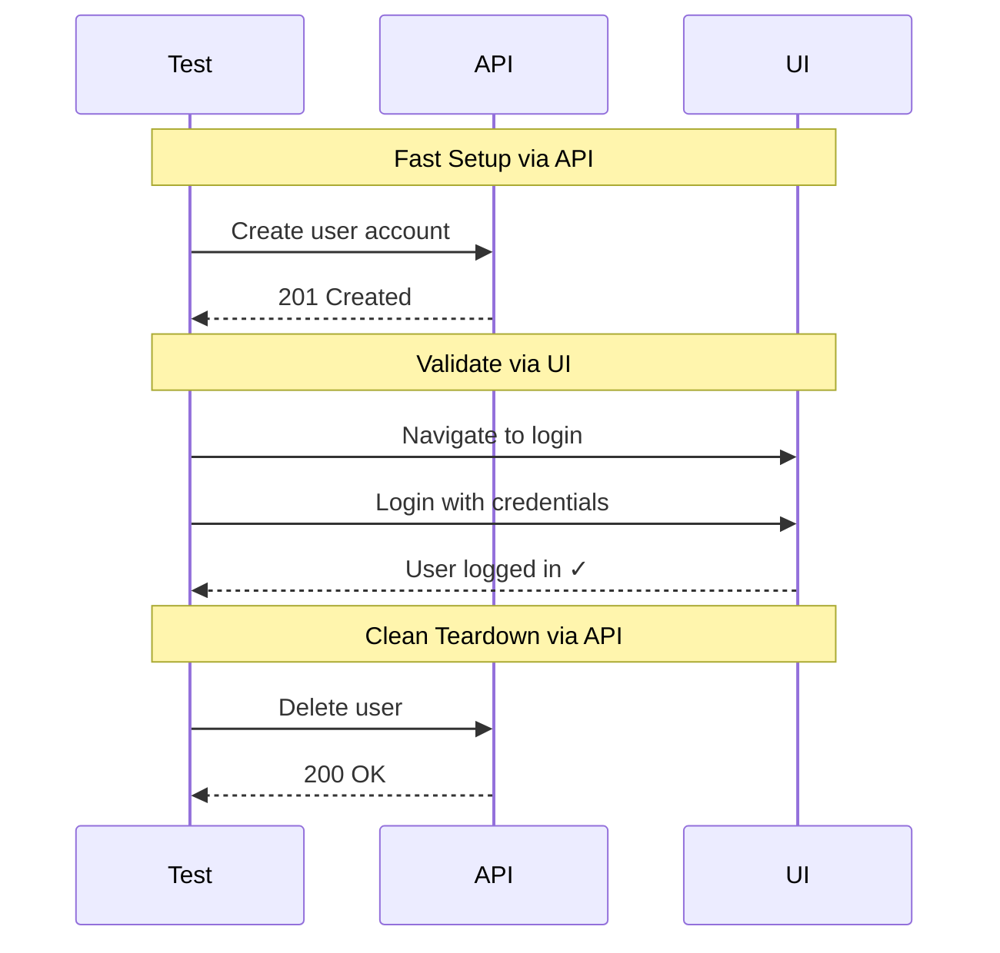

**Benefits:** ⚡ Fast setup | 🧹 Reliable cleanup | 🎯 Focused validation | 💪 Less flaky

---

## 🔄 GitHub Actions CI/CD

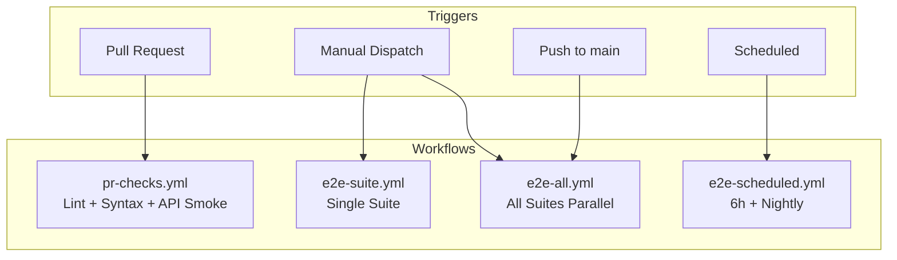

### Workflow Summary

| Workflow | Trigger | Description |
|----------|---------|-------------|
| `pr-checks.yml` | PR/Push | Lint ✓ Syntax ✓ API Smoke tests (no browser) |
| `e2e-suite.yml` | Manual | Run single suite by tag |
| `e2e-all.yml` | Manual/ to main | Full E2E Parallel suites (runs after merge to main) |
| `e2e-scheduled.yml` | Cron | Every 6h smoke, nightly regression |

---

## 🐳 Docker

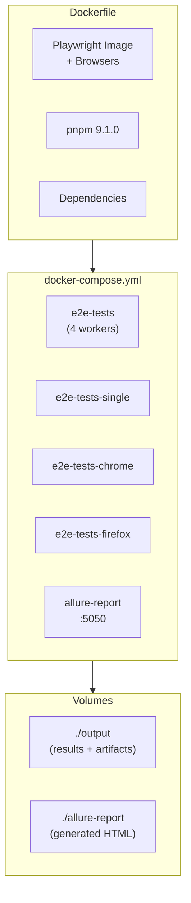

### Quick Commands

```bash
docker-compose build                              # Build image
docker-compose up e2e-tests                       # Run parallel (4 workers)
PROFILE=local:@auth:chromeHeadless docker-compose up e2e-tests  # Custom profile
docker-compose up -d allure-report && open http://localhost:5050  # View reports
```

<details>
<summary>📖 All Docker Services</summary>

| Service | Description |
|---------|-------------|
| `e2e-tests` | Sequential execution (runs tests and generates report) |
| `e2e-tests-parallel` | Parallel execution (4 workers) - commented out |
| `e2e-tests-firefox` | Firefox headless only - commented out |
| `allure-report` | Report server on :5050 (nginx) |

</details>

### Local vs Docker

| | Local | Docker |
|--|-------|--------|
| **Setup** | Node + pnpm + browsers | Just Docker |
| **Speed** | ⚡ Faster | Slightly slower |
| **Consistency** | Varies | ✅ Always same |
| **Debugging** | ✅ Visible browser | Headless only |

> 💡 **Tip:** Use local for dev/debug, Docker for CI/CD

---

## 📊 Reports

### Automatic Report Generation

Reports are **automatically generated** after each test run:

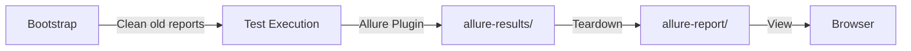

### How It Works

1. **Bootstrap** (`e2e/config/bootstrap.js`): Cleans previous `allure-results/` and `allure-report/` directories
2. **During test run**: Allure plugin writes results to `output/allure-results/`
3. **Teardown** (`e2e/config/teardown.js`): Automatically generates HTML report to `allure-report/`
4. **Console output**: Displays command to view the report

### View Report Commands

After test execution, you'll see:

```
============================================================
📊 VIEW TEST REPORT:
   pnpm run allure:open
   OR
   npx allure open ./allure-report
============================================================
```

### Manual Commands (if needed)

```bash
pnpm run allure:generate   # Regenerate report from allure-results/
pnpm run allure:open       # Open generated report in browser
pnpm run allure:serve      # Start auto-refresh server for live viewing
```

### Allure Plugin Configuration

Configured in `e2e/config/getPlugins.js`:

```javascript
allure: {
  enabled: true,
  require: 'allure-codeceptjs',
  outputDir: './output/allure-results',
  enableScreenshotDiffPlugin: true,
}
```

> 💡 **Note:** Reports are auto-generated in teardown. No manual step needed after test runs.

---

## ➕ Adding New Tests

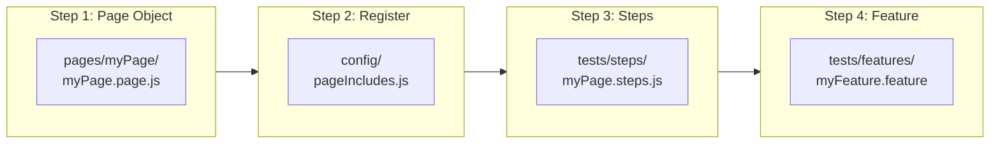

<details>
<summary>📖 Code Examples</summary>

**1. Page Object** (`pages/myPage/myPage.page.js`)

```javascript
const { I } = inject();
module.exports = () => ({
  myElement: locate('selector'),
  async doSomething() { await I.click(this.myElement); },
});
```

**2. Register** (`config/pageIncludes.js`)

```javascript
exports.include = { myPage: './pages/myPage/myPage.page.js' };
```

**3. Steps** (`tests/steps/myPage.steps.js`)

```javascript
const { I, myPage } = inject();
When('the user does something', async () => { await myPage.doSomething(); });
```

**4. Feature** (`tests/features/myFeature.feature`)

```gherkin
@myFeature
Feature: My Feature
  Scenario: Test something
    Given the user is on the home page
    When the user does something
    Then the user should see "expected result"
```

</details>

---

## 🔍 Locator Patterns

```javascript
// Preferred: data-qa attribute
locate('input').withAttr({ 'data-qa': 'login-email' })

// CSS selector
locate('.product-card')

// By text
locate('button').withText('Submit')

// XPath
locate('//div[@class="container"]//a')
```

---

## 🤖 Playwright MCP Testing

> 📖 **Full Documentation**: [docs/AI_TESTING.md](docs/AI_TESTING.md)

Run tests using Playwright MCP with AI-powered analysis:

```bash
# Run all @playwrightMCP tagged tests
pnpm e2e local:@playwrightMCP:chromeHeadless

# Run with visible browser
pnpm e2e local:@playwrightMCP:chrome
```

### AI Provider Options

| Provider | Cost | Setup |
|----------|------|-------|
| **Ollama** (default) | 🆓 Free | `brew install ollama && ollama serve && ollama pull llama3.2` |
| Groq | 🆓 Free tier | Get key from [console.groq.com](https://console.groq.com/keys) |
| Perplexity | 💰 Paid | Get key from [perplexity.ai](https://www.perplexity.ai/settings/api) |

```bash
# Default: Ollama (free, local) - no config needed if Ollama is running
# Or switch provider in e2e/.env:
AI_PROVIDER=ollama  # or groq, perplexity
```

**Features:**

- AI-powered test result analysis
- **Network traffic analysis** with AI insights
- Automatic test scenario generation
- Failure root cause analysis
- Allure report integration

### Network Traffic Analysis

```bash
# Run network analysis tests
pnpm e2e local:@network-analysis:chrome
```

Captures and analyzes all network requests/responses during test execution:

- Request/response counts and status codes
- API endpoint monitoring
- Error detection (4xx/5xx responses)
- AI-generated performance insights

See [docs/AI_TESTING.md](docs/AI_TESTING.md) for detailed documentation.

---

## 🤖 AI-Assisted Test Creation

### Universal Prompts (Any AI Assistant)

Use these prompts with **GitHub Copilot, Cursor, ChatGPT, Claude**, or any AI:

| Prompt | Use Case |
|--------|----------|
| [docs/prompts/ADD_TEST.md](docs/prompts/ADD_TEST.md) | Create new UI, API, or combined tests |
| [docs/prompts/AI_ANALYSIS.md](docs/prompts/AI_ANALYSIS.md) | Run tests with AI analysis (Ollama) |

Simply copy the prompt and paste into your AI assistant!

---

## 📄 License

ISC
