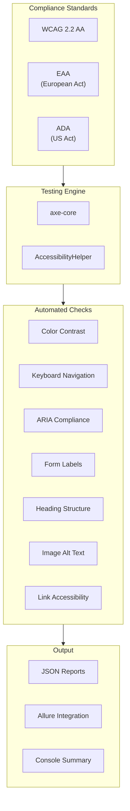

# ♿ Accessibility Testing Guide

This document covers the accessibility testing capabilities integrated into the E2E framework, supporting WCAG 2.2 AA, EAA (European Accessibility Act), and ADA (Americans with Disabilities Act) compliance testing.

---

## 📋 Table of Contents

- [Overview](#overview)
- [Compliance Standards](#compliance-standards)
- [Architecture](#architecture)
- [Running Accessibility Tests](#running-accessibility-tests)
- [AccessibilityHelper API](#accessibilityhelper-api)
- [Step Definitions](#step-definitions)
- [Feature File Examples](#feature-file-examples)
- [Reports](#reports)
- [Best Practices](#best-practices)

---

## Overview

The accessibility testing module provides automated compliance scanning using **axe-core**, the industry-standard accessibility testing engine.

### Key Features

- **Multi-Standard Support**: WCAG 2.2 AA, EAA, ADA compliance
- **Granular Checks**: Color contrast, keyboard nav, ARIA, forms, headings
- **Element-Specific Scans**: Test navigation, footer, forms independently
- **Detailed Reporting**: JSON reports with violation details and remediation links
- **CI/CD Integration**: Fail builds on critical violations



---

## Compliance Standards

### WCAG 2.2 AA

The Web Content Accessibility Guidelines (WCAG) 2.2 Level AA is the most widely adopted standard.

**Covered Principles:**
- **Perceivable**: Text alternatives, captions, adaptable content
- **Operable**: Keyboard accessible, enough time, seizure-safe
- **Understandable**: Readable, predictable, input assistance
- **Robust**: Compatible with assistive technologies

### EAA (European Accessibility Act)

The European Accessibility Act aligns with EN 301 549, which references WCAG 2.1 AA.

**Effective**: June 28, 2025 for most products/services

### ADA (Americans with Disabilities Act)

US federal law requiring accessibility, typically interpreted as WCAG 2.0/2.1 AA compliance.

---

## Architecture

### File Structure

```
e2e/
├── helpers/
│   └── accessibilityHelper.js    # Core accessibility helper class
├── tests/
│   ├── features/
│   │   └── accessibility/
│   │       └── accessibility.feature  # Gherkin test scenarios
│   └── steps/
│       └── accessibility.steps.js     # Step definitions
└── output/
    └── accessibility/            # Generated reports
```

### Helper Class

`e2e/helpers/accessibilityHelper.js` extends CodeceptJS Helper class and wraps axe-core.

---

## Running Accessibility Tests

### Quick Commands

```bash
# All accessibility tests
pnpm e2e local:@accessibility:chromeHeadless

# WCAG 2.2 AA only
pnpm e2e local:@wcag22aa:chromeHeadless

# European Accessibility Act
pnpm e2e local:@eaa:chromeHeadless

# Americans with Disabilities Act
pnpm e2e local:@ada:chromeHeadless

# Specific checks
pnpm e2e local:@color-contrast:chromeHeadless
pnpm e2e local:@keyboard:chromeHeadless
pnpm e2e local:@forms:chromeHeadless
```

### NPM Script Shortcuts

```bash
pnpm e2e:a11y    # All accessibility tests
pnpm e2e:wcag    # WCAG 2.2 AA
pnpm e2e:eaa     # European Accessibility Act
pnpm e2e:ada     # ADA compliance
```

---

## AccessibilityHelper API

### Full Page Scans

#### `runAccessibilityScan(options)`

Run a full accessibility scan with custom options.

```javascript
const results = await helper.runAccessibilityScan({
  tags: ['wcag2a', 'wcag2aa', 'wcag21aa'],
  exclude: ['.advertisement', 'iframe'],
  include: ['main', 'nav'],
  disableRules: ['color-contrast'],
});
```

#### `runWCAG22AAScan(options)`

WCAG 2.2 AA compliance scan.

```javascript
const results = await helper.runWCAG22AAScan();
```

#### `runEAAScan(options)`

European Accessibility Act compliance scan.

```javascript
const results = await helper.runEAAScan();
```

#### `runADAScan(options)`

ADA compliance scan.

```javascript
const results = await helper.runADAScan();
```

### Specific Checks

| Method | Description |
|--------|-------------|
| `checkColorContrast()` | Verify text color contrast ratios |
| `checkKeyboardAccessibility()` | Test keyboard navigation and focus |
| `checkImageAccessibility()` | Verify alt text on images |
| `checkFormAccessibility()` | Test form labels and inputs |
| `checkHeadingStructure()` | Verify heading hierarchy |
| `checkARIACompliance()` | Test ARIA attribute usage |
| `checkLinkAccessibility()` | Verify link names and purposes |

### Element-Specific Scans

#### `scanElement(selector, options)`

Scan a specific element or region.

```javascript
// Scan navigation
const navResults = await helper.scanElement('nav, .navbar, header');

// Scan footer
const footerResults = await helper.scanElement('footer');

// Scan main content
const mainResults = await helper.scanElement('main, .main-content');
```

### Assertions

#### `assertNoViolations(results, allowedImpacts)`

Assert no violations (optionally allow certain impact levels).

```javascript
// Fail on any violation
helper.assertNoViolations(results);

// Allow minor violations
helper.assertNoViolations(results, ['minor']);
```

#### `assertNoCriticalViolations(results)`

Assert no critical or serious violations.

```javascript
helper.assertNoCriticalViolations(results);
```

### Reporting

#### `getViolationSummary(results)`

Get a summary of violations by impact level.

```javascript
const summary = helper.getViolationSummary(results);
// Returns: { total, critical, serious, moderate, minor, passes, incomplete }
```

#### `generateReport(results, pageName)`

Generate a formatted report object.

```javascript
const report = helper.generateReport(results, 'Home Page');
```

#### `saveReport(results, filename)`

Save report to JSON file.

```javascript
await helper.saveReport(results, 'home-page-a11y');
// Saves to: ./output/accessibility/home-page-a11y.json
```

---

## Step Definitions

### Navigation Steps

```gherkin
Given the user is on the home page for accessibility testing
Given the user is on the "login" page for accessibility testing
Given the user is on the "products" page for accessibility testing
```

### Full Scan Steps

```gherkin
When the user runs a full accessibility scan
When the user runs a WCAG 2.2 AA compliance scan
When the user runs an EAA compliance scan
When the user runs an ADA compliance scan
When the user runs a combined WCAG, EAA, and ADA compliance scan
```

### Specific Check Steps

```gherkin
When the user checks color contrast
When the user checks keyboard accessibility
When the user checks image accessibility
When the user checks form accessibility
When the user checks heading structure
When the user checks ARIA compliance
When the user checks link accessibility
```

### Element Scan Steps

```gherkin
When the user scans the "selector" element for accessibility
When the user scans the navigation for accessibility
When the user scans the footer for accessibility
When the user scans the main content for accessibility
When the user scans forms for accessibility
```

### Assertion Steps

```gherkin
Then there should be no accessibility violations
Then there should be no critical accessibility violations
Then there should be no serious accessibility violations
Then there should be fewer than 5 accessibility violations
Then the page should pass WCAG 2.2 AA requirements
Then the page should pass EAA requirements
Then the page should pass ADA requirements
```

### Reporting Steps

```gherkin
Then the user generates an accessibility report
Then the user saves the accessibility report as "report-name"
Then the user logs the accessibility summary
Then the user logs all violations
```

### Exclusion Steps

```gherkin
When the user runs accessibility scan excluding ".ads"
When the user runs accessibility scan excluding ads and third-party content
```

---

## Feature File Examples

### Basic WCAG Compliance

```gherkin
@accessibility @wcag22aa @smoke
Feature: WCAG 2.2 AA Compliance

  Scenario: Home page meets WCAG 2.2 AA standards
    Given the user is on the home page for accessibility testing
    When the user runs a WCAG 2.2 AA compliance scan
    Then there should be no critical accessibility violations
    And the user logs the accessibility summary
```

### Multi-Page Compliance

```gherkin
@accessibility @wcag22aa
Feature: Site-Wide Accessibility

  Scenario Outline: <page> page accessibility compliance
    Given the user is on the "<page>" page for accessibility testing
    When the user runs a WCAG 2.2 AA compliance scan
    Then there should be no critical accessibility violations
    And the user saves the accessibility report as "<page>-a11y"

  Examples:
    | page     |
    | home     |
    | login    |
    | products |
    | cart     |
    | contact  |
```

### Specific Component Testing

```gherkin
@accessibility @wcag22aa @forms
Feature: Form Accessibility

  Scenario: Login form is accessible
    Given the user is on the "login" page for accessibility testing
    When the user checks form accessibility
    Then there should be no critical accessibility violations
    And the user logs the accessibility summary

  Scenario: Contact form is accessible
    Given the user is on the "contact" page for accessibility testing
    When the user checks form accessibility
    Then there should be no serious accessibility violations
```

### Comprehensive Multi-Standard

```gherkin
@accessibility @wcag22aa @eaa @ada @comprehensive
Feature: Multi-Standard Compliance

  Scenario: Full compliance check
    Given the user is on the home page for accessibility testing
    When the user runs a combined WCAG, EAA, and ADA compliance scan
    Then there should be no critical accessibility violations
    And the user logs all violations
    And the user generates an accessibility report
    And the user saves the accessibility report as "comprehensive-a11y"
```

### Excluding Third-Party Content

```gherkin
@accessibility @wcag22aa
Feature: First-Party Content Accessibility

  Scenario: Accessibility excluding ads
    Given the user is on the home page for accessibility testing
    When the user runs accessibility scan excluding ads and third-party content
    Then there should be no critical accessibility violations
```

---

## Reports

### Markdown Report (ACCESSIBILITY_REPORT.md)

When running accessibility tests with the `@accessibility` tag, a detailed **Markdown report** is automatically generated at `e2e/ACCESSIBILITY_REPORT.md`.

**Features:**
- **Auto-generated** on each accessibility test run
- **Detailed violations** with impact levels (🔴 Critical, 🟠 Serious, 🟡 Moderate, 🟢 Minor)
- **WCAG references** with links to Deque University remediation guides
- **Affected elements** with CSS selectors for easy identification
- **Summary tables** showing violation counts per scan

**Example output:**
```markdown
# Accessibility Test Report

## Test Run: 6/16/2026, 7:15:39 PM

## Home Page - WCAG 2.2 AA Scan

**URL:** https://automationexercise.com/
**Timestamp:** 2026-06-16T18:15:39.078Z

### Summary

| Metric | Count |
|--------|-------|
| Total Violations | 3 |
| Critical | 1 |
| Serious | 2 |

### Violations

#### 1. 🔴 [CRITICAL] button-name

**Description:** Buttons must have discernible text
**WCAG:** wcag2a, wcag412
**Help:** [Deque University](https://dequeuniversity.com/rules/axe/4.11/button-name)

**Affected Elements (1):**
- `#subscribe`
```

**After test run, you'll see:**
```
============================================================
📊 VIEW TEST REPORT:
   pnpm run allure:open

♿ ACCESSIBILITY REPORT:
   📄 /path/to/e2e/ACCESSIBILITY_REPORT.md
   Open with: open ACCESSIBILITY_REPORT.md
============================================================
```

### JSON Report Structure

Reports are also saved to `./output/accessibility/` in JSON format:

```json
{
  "pageName": "Home Page",
  "timestamp": "2024-01-15T10:30:00.000Z",
  "url": "https://automationexercise.com/",
  "summary": {
    "total": 5,
    "critical": 0,
    "serious": 2,
    "moderate": 2,
    "minor": 1,
    "passes": 45,
    "incomplete": 3
  },
  "violations": [
    {
      "id": "color-contrast",
      "impact": "serious",
      "description": "Ensures the contrast between foreground and background colors meets WCAG 2 AA contrast ratio thresholds",
      "help": "Elements must have sufficient color contrast",
      "helpUrl": "https://dequeuniversity.com/rules/axe/4.8/color-contrast",
      "wcagTags": ["wcag2aa", "wcag143"],
      "nodes": 3,
      "elements": [
        {
          "html": "<span class=\"low-contrast\">Text</span>",
          "target": [".low-contrast"],
          "failureSummary": "Fix any of the following: Element has insufficient color contrast of 3.5:1"
        }
      ]
    }
  ],
  "passes": 45,
  "incomplete": [...]
}
```

### Console Output

```
=== Accessibility Scan Summary ===
Total Violations: 5
  - Critical: 0
  - Serious: 2
  - Moderate: 2
  - Minor: 1
Passes: 45
Incomplete: 3
==================================
```

### Allure Integration

Accessibility results are automatically attached to Allure reports when using the allure plugin.

---

## Best Practices

### 1. Test Early and Often

```bash
# Add to CI pipeline
pnpm e2e local:@accessibility:chromeHeadless
```

### 2. Start with Critical Violations

Focus on critical/serious issues first:

```gherkin
Then there should be no critical accessibility violations
```

### 3. Test Key User Flows

Prioritize pages users interact with most:
- Home page
- Login/Registration
- Product pages
- Checkout flow

### 4. Exclude Third-Party Content

Don't fail builds on content you can't control:

```gherkin
When the user runs accessibility scan excluding ads and third-party content
```

### 5. Document Known Issues

Track violations you're working on:

```javascript
// Temporarily disable known issues
await helper.runAccessibilityScan({
  disableRules: ['color-contrast'], // TODO: Fix in sprint 5
});
```

### 6. Regular Full Scans

Run comprehensive scans periodically:

```bash
# Nightly regression
pnpm e2e local:@comprehensive:chromeHeadless
```

---

## Violation Impact Levels

| Impact | Description | Action |
|--------|-------------|--------|
| **Critical** | Blocks users completely | Fix immediately |
| **Serious** | Significantly impacts users | Fix in current sprint |
| **Moderate** | Causes difficulty | Plan to fix |
| **Minor** | Inconvenience | Fix when possible |

---

## Common Violations & Fixes

### Color Contrast

**Issue**: Text doesn't meet 4.5:1 contrast ratio

**Fix**: Increase contrast between text and background colors

### Missing Alt Text

**Issue**: Images lack alternative text

**Fix**: Add descriptive `alt` attributes to images

### Form Labels

**Issue**: Form inputs lack associated labels

**Fix**: Add `<label>` elements with `for` attribute

### Heading Order

**Issue**: Headings skip levels (h1 → h3)

**Fix**: Use sequential heading levels

### Keyboard Focus

**Issue**: Interactive elements not keyboard accessible

**Fix**: Ensure all clickable elements are focusable

---

## Related Documentation

- [Main README](../README.md)
- [AI Testing Guide](./AI_TESTING.md)
- [axe-core Rules](https://dequeuniversity.com/rules/axe/)
- [WCAG 2.2 Guidelines](https://www.w3.org/TR/WCAG22/)
