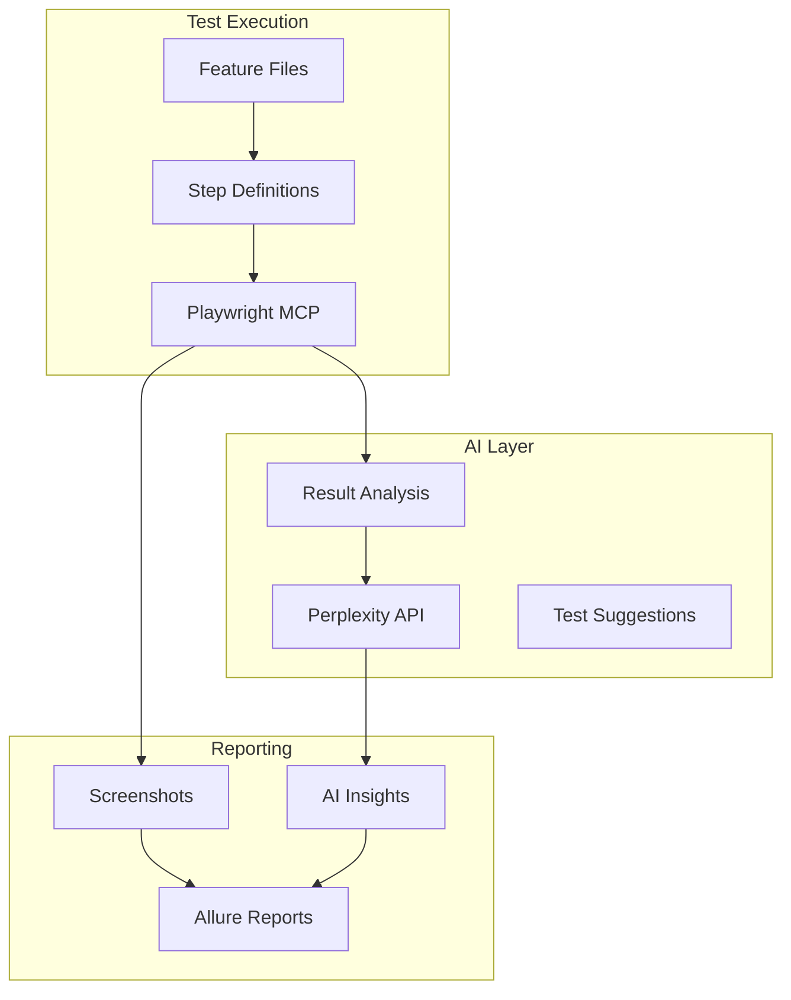

# 🤖 AI-Powered Testing with Playwright MCP

This document covers the AI-powered testing capabilities integrated into the E2E framework using Playwright MCP (Model Context Protocol) and Perplexity AI.

---

## 📋 Table of Contents

- [Overview](#overview)
- [Prerequisites](#prerequisites)
- [Perplexity AI Integration](#perplexity-ai-integration)
- [Playwright MCP Testing](#playwright-mcp-testing)
- [Step Definitions](#step-definitions)
- [Feature File Examples](#feature-file-examples)
- [Running Tests](#running-tests)
- [Allure Reporting](#allure-reporting)
- [Troubleshooting](#troubleshooting)

---

## Overview

The AI testing module provides:

- **Playwright MCP Integration**: Browser automation via Model Context Protocol
- **Perplexity AI Analysis**: Intelligent test result analysis and insights
- **AI-Generated Test Suggestions**: Automatic BDD scenario generation
- **Failure Root Cause Analysis**: AI-powered debugging assistance
- **Allure Reporting**: Rich test reports with AI insights attached



---

## Prerequisites

### 1. AI Provider Setup

The framework supports multiple AI providers. **Ollama is the default (free, local)**.

#### Option A: Ollama (Recommended - FREE)

```bash
# 1. Install Ollama
# macOS: brew install ollama
# Or download from: https://ollama.ai/download

# 2. Start Ollama server
ollama serve

# 3. Pull a model (one-time)
ollama pull llama3.2

# 4. Configure in e2e/.env (optional - these are defaults)
AI_PROVIDER=ollama
OLLAMA_URL=http://localhost:11434/api/generate
OLLAMA_MODEL=llama3.2
```

#### Option B: Groq (FREE tier)

```bash
# Get free API key from: https://console.groq.com/keys
AI_PROVIDER=groq
GROQ_API_KEY=gsk_xxxxxxxxxxxxxxxxxxxxxxxxxxxxxxxx
```

#### Option C: Perplexity (PAID)

```bash
# Get API key from: https://www.perplexity.ai/settings/api
AI_PROVIDER=perplexity
PERPLEXITY_API_KEY=pplx-xxxxxxxxxxxxxxxxxxxxxxxxxxxxxxxx
```

### 2. Dependencies

The framework uses these packages (already included):
- `axios` - HTTP client for AI APIs
- `allure-codeceptjs` - Allure reporting plugin

### 3. MCP Server

Ensure Playwright MCP server is configured in your IDE settings.

---

## Perplexity AI Integration

### Helper Location

`e2e/helpers/perplexityHelper.js`

### Available Functions

#### `analyzeWithPerplexity(data, context)`

Analyzes test data or results using Perplexity AI.

```javascript
const { analyzeWithPerplexity } = require('../../helpers/perplexityHelper');

// Analyze API response
const analysis = await analyzeWithPerplexity(apiResponse, 'API test result');

// Analyze page content
const pageAnalysis = await analyzeWithPerplexity(htmlContent, 'web page content');
```

**Parameters:**
- `data` (string|object): Data to analyze
- `context` (string): Context description for the AI

**Returns:** AI-generated analysis string

#### `generateTestSuggestions(featureDescription)`

Generates BDD test scenarios using AI.

```javascript
const { generateTestSuggestions } = require('../../helpers/perplexityHelper');

const scenarios = await generateTestSuggestions('User login with 2FA');
// Returns Gherkin-formatted test scenarios
```

#### `analyzeTestFailure(failureData)`

Provides root cause analysis for test failures.

```javascript
const { analyzeTestFailure } = require('../../helpers/perplexityHelper');

const analysis = await analyzeTestFailure({
  testName: 'Login test',
  error: 'Element not found',
  stack: '...'
});
// Returns: root cause, suggested fix, prevention tips
```

---

## Playwright MCP Testing

### Tag Convention

Use `@playwrightMCP` tag to mark tests for MCP execution:

```gherkin
@playwrightMCP @smoke
Feature: MCP Browser Testing
```

### Step Definitions Location

`e2e/tests/steps/playwrightMcp.steps.js`

### Available MCP Steps

#### Navigation

```gherkin
Given the MCP browser navigates to the home page
Given the MCP browser navigates to the login page
Given the MCP browser navigates to the products page
Given the MCP browser navigates to "/custom-path"
```

#### Snapshots & Screenshots

```gherkin
When the MCP browser takes a snapshot
When the MCP browser captures page accessibility tree
When the MCP browser takes a screenshot named "page-name"
When the MCP browser takes a full page screenshot named "full-page"
Then the snapshot should contain "expected text"
Then the screenshot should be saved to allure results
```

#### Form Interactions

```gherkin
When the MCP browser fills the login form with email "test@example.com" and password "Pass123"
When the MCP browser fills form field "selector" with "value"
When the MCP browser clicks the login button
When the MCP browser clicks on "selector"
When the MCP browser clicks element with text "Button Text"
```

#### Waits & Verification

```gherkin
When the MCP browser waits for "selector" to be visible
When the MCP browser waits for text "Loading complete"
When the MCP browser waits 5 seconds
Then the MCP browser should see "expected text"
Then the MCP browser should not see "unexpected text"
Then the MCP browser URL should contain "/expected-path"
```

#### AI Analysis

```gherkin
When the user analyzes test results with Perplexity
When the user analyzes page content with Perplexity
When the user analyzes test failure with Perplexity
Then the AI analysis should be attached to Allure report
Then the AI analysis should contain insights
```

#### Network Traffic Analysis

```gherkin
When the MCP browser starts network capture
When the MCP browser captures network requests
When the user analyzes network traffic with AI
Then the network analysis should be attached to Allure report
Then there should be no network errors
Then all API calls should return success
```

#### State Management

```gherkin
When the MCP browser stores current state
Then the page title should be "Expected Title"
```

---

## Feature File Examples

### Basic MCP Navigation Test

```gherkin
@playwrightMCP @smoke
Feature: MCP Navigation Testing

  @mcp-navigation
  Scenario: Verify home page loads
    Given the MCP browser navigates to the home page
    When the MCP browser takes a snapshot
    Then the snapshot should contain "Automation Exercise"
```

### Form Interaction with AI Analysis

```gherkin
@playwrightMCP @ai
Feature: Login with AI Analysis

  @mcp-login @ai-analysis
  Scenario: Login and analyze results
    Given the MCP browser navigates to the login page
    When the MCP browser fills the login form with email "test@test.com" and password "Test123"
    And the MCP browser clicks the login button
    And the MCP browser takes a snapshot
    And the user analyzes test results with Perplexity
    Then the AI analysis should be attached to Allure report
```

### API + MCP UI Combination

```gherkin
@playwrightMCP @api-ui
Feature: API Setup with MCP Verification

  @combination
  Scenario: Create user via API, verify via MCP
    # API Setup
    Given the user generates a test user
    When the user creates user account via API
    Then the API response code should be 201
    
    # MCP UI Verification
    When the MCP browser navigates to the login page
    And the MCP browser fills the login form with email "generated@email.com" and password "GenPass123"
    And the MCP browser clicks the login button
    Then the MCP browser should see "Logged in as"
    
    # AI Analysis
    When the user analyzes test results with Perplexity
    Then the AI analysis should be attached to Allure report
    
    # Cleanup
    When the user deletes user account via API
```

### Visual Verification Flow

```gherkin
@playwrightMCP @visual
Feature: Visual Testing with Screenshots

  @screenshots
  Scenario: Capture page screenshots for review
    Given the MCP browser navigates to the home page
    When the MCP browser takes a screenshot named "home-initial"
    And the MCP browser clicks element with text "Products"
    And the MCP browser waits for text "All Products"
    And the MCP browser takes a full page screenshot named "products-full"
    Then the screenshot should be saved to allure results
```

### Network Traffic Analysis with AI

```gherkin
@playwrightMCP @ai @mcp-network
Feature: Network Traffic Analysis

  @network-analysis
  Scenario: Analyze network traffic with AI
    Given the MCP browser navigates to the home page
    When the MCP browser starts network capture
    And the MCP browser navigates to the products page
    And the MCP browser waits 3 seconds
    And the MCP browser captures network requests
    And the user analyzes network traffic with AI
    Then the network analysis should be attached to Allure report
    And there should be no network errors

  @network-errors
  Scenario: Verify no network errors during navigation
    Given the MCP browser navigates to the home page
    When the MCP browser starts network capture
    And the MCP browser navigates to the products page
    And the MCP browser navigates to "/view_cart"
    And the MCP browser captures network requests
    Then there should be no network errors
    And all API calls should return success
```

**Network Analysis Output:**
- Total requests/responses count
- Status code distribution (2xx, 3xx, 4xx, 5xx)
- Resource type breakdown (document, script, image, xhr, fetch)
- Error details with URLs
- API endpoint calls with methods and status codes
- AI-generated insights on performance and issues

---

## Running Tests

### Command Format

```bash
# Run all @playwrightMCP tests
pnpm e2e local:@playwrightMCP:chromeHeadless

# Run with visible browser for debugging
pnpm e2e local:@playwrightMCP:chrome

# Run specific MCP scenario tags
pnpm e2e local:@mcp-navigation:chromeHeadless
pnpm e2e local:@ai-analysis:chromeHeadless

# Run with parallel execution
pnpm e2e:parallel local:@playwrightMCP:chromeHeadless 4
```

### Environment Variables

```bash
# Required for AI features
PERPLEXITY_API_KEY=pplx-xxx

# Optional configuration
ENVIRONMENT=local
BROWSER=chromeHeadless
```

---

## Allure Reporting

### Generate Reports

```bash
# Generate report from results
pnpm run allure:generate

# Open report in browser
pnpm run allure:open

# Serve with auto-refresh
pnpm run allure:serve
```

### Report Contents

AI-powered tests include:
- **Screenshots**: Captured at key steps
- **AI Analysis**: Perplexity insights attached as report attachments
- **Page Snapshots**: HTML content for debugging
- **Failure Analysis**: AI-generated root cause when tests fail

---

## Test State Management

The `testState` module stores MCP-specific data:

```javascript
// e2e/data/testState.js
{
  mcpSnapshot: null,      // HTML snapshot of page
  pageTitle: null,        // Current page title
  currentUrl: null,       // Current URL
  loginResult: null,      // Login attempt result
  lastScreenshot: null,   // Last screenshot filename
  aiAnalysis: null,       // Perplexity AI analysis
  lastError: null,        // Last error for failure analysis
  networkSummary: null,   // Network traffic summary
  networkAnalysis: null,  // AI analysis of network traffic
}
```

---

## Troubleshooting

### Common Issues

| Issue | Solution |
|-------|----------|
| `PERPLEXITY_API_KEY not set` | Add key to `e2e/.env` file |
| `AI analysis failed` | Check API key validity and rate limits |
| `MCP not responding` | Restart MCP server in IDE |
| `Screenshots not saving` | Check `./output` directory permissions |
| `Allure report empty` | Run `pnpm run allure:generate` first |

### Debug Mode

```bash
# Enable verbose logging
DEBUG=codeceptjs:* pnpm e2e local:@playwrightMCP:chrome
```

### API Rate Limits

Perplexity API has rate limits. For large test suites:
- Use AI analysis selectively (not every test)
- Add delays between AI calls if needed
- Consider caching repeated analyses

---

## Best Practices

1. **Tag Appropriately**: Use `@playwrightMCP` for MCP tests, `@ai` for AI analysis
2. **Selective AI Usage**: Don't analyze every test - focus on failures and key flows
3. **Screenshot Naming**: Use descriptive names for easy identification
4. **State Cleanup**: Reset `testState` between scenarios if needed
5. **Error Handling**: Wrap AI calls in try-catch for graceful degradation

---

## Related Documentation

- [Main README](../README.md)
- [Accessibility Testing](./ACCESSIBILITY.md)
- [AI Prompts](./prompts/) - Universal prompts for any AI assistant
